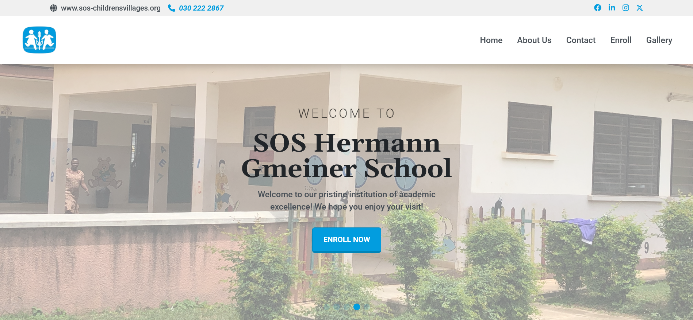
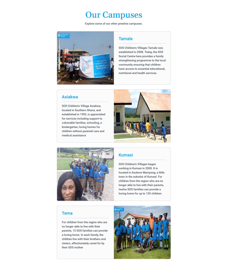
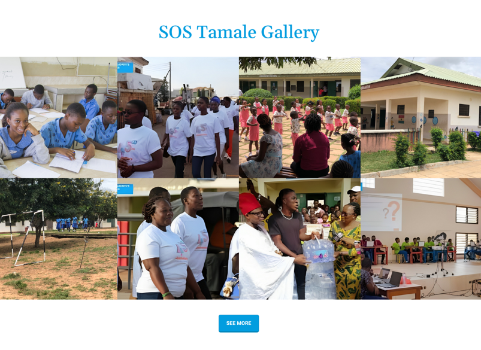
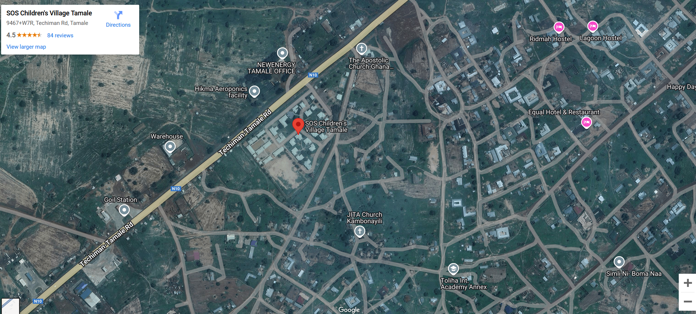
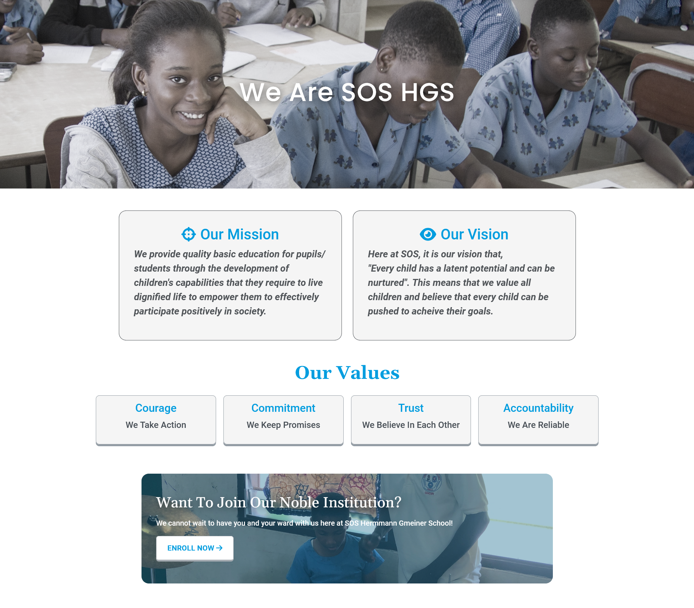
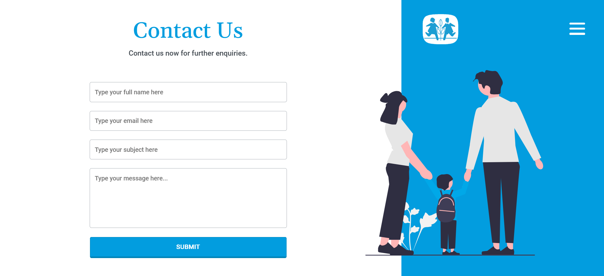
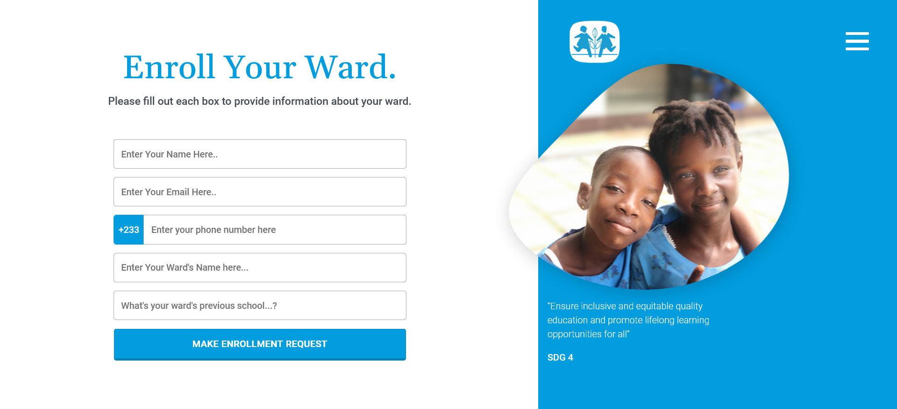

Deploy status from Netlify
 

---
# SOS HGS-TL WEBSITE 🏫

A website for our school, [SOS HGS Tamale](c:\Users\alexa\OneDrive\Desktop\programming\README-template.md)

## Table of contents 📑

- [Features and Screenshots✨🖼️](#features-and-screenshots-✨🖼️)
- [Technologies Used 🔬](#technologies-used-🔬)
- [License 📝](#license-📝)
- [Project Status 🔥](#project-status-🔥)
- [Plans for the future 🗺️](#plans-for-the-future]-🗺️)
- [Authors 👤👤](#author-👤👤)
- [Contact 📧](#contact-📧)

## Features and Screenshots ✨🖼️

- Landing Page, which displays

  - Hero:
  - Campuses around the country: 
  - Gallery preview: 
  - Map: 

- About page: 
- Contact page: 
- Enrollment page: 
- Full Gallery: 

There is also a fully functional mobile and tablet view as well:

- Mobile: 

- Tablet: 

(the blank whitespace is the map, it did not fully load when i took these pictures)

## Technologies Used 🔬

- React.js
- SASS

<!-- ## License 📝

This project is licensed under the [License Name](link-to-license-file). -->

## Project Status 🔥

1. Earlier this year, we planned to implement an _admin dashboard_ to allow for administration of the website directly from certain authorized users.

   Unfortunately, we did not have enough time to implement. We estimate it could take as long as **6 months** to complete it. **The dashboard has been scrapped from our plans.**

2. We also planned a section displaying a _video tour_ of the school campus. **However we did not have enough time to record said video.**

3. We also had plans for a page indicating the school guidelines. **However we could not retrieve a soft copy of said guidelines.**

---

Currently, the project is 99% completed, with most of the work now being polishing and fine-tuning certain visuals, and looking for mistakes in our code.

It is ready for deployment/hosting, and, as of now, no major work is being done.

## Plans for the future 🗺️

We currently have **no plans** for the website as of October 2024. However routine checks and updates every few months will be necessary.

## Authors 👤👤

This website was developed by:

- Alexander Afoko Jnr
- Emmanuel Opoku-Ameyaw

## Contact 📧

## Alexander Afoko Jnr

- Email - alexanderafoko@gmail.com
- Github - [BeanyTheCoder](https://github.com/BeanyTheCoder)

## Emmanuel Opoku-Ameyaw

- Email - ameyawemmanuel900@gmail.com
- Github - [thepro7](https://github.com/the-pro7)

## Beany-bready LLC

- Github: https://github.com/Beany-Bready-Org
